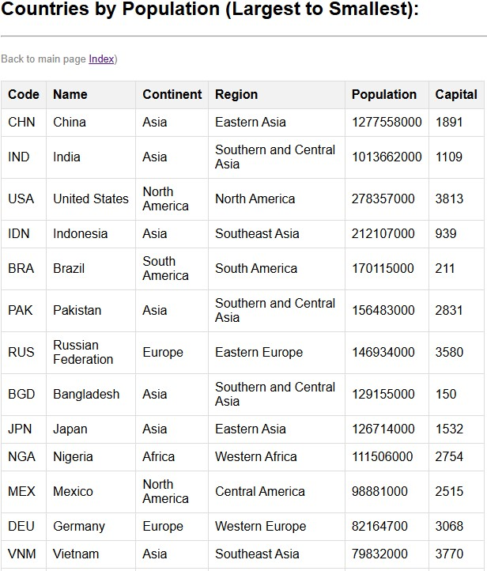
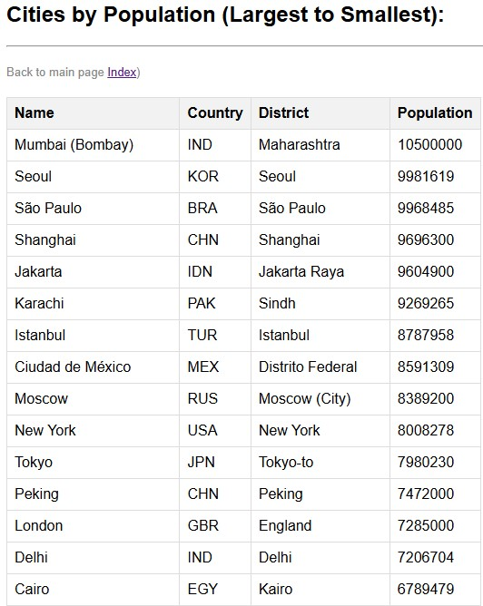
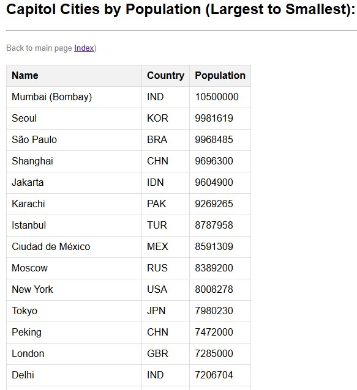
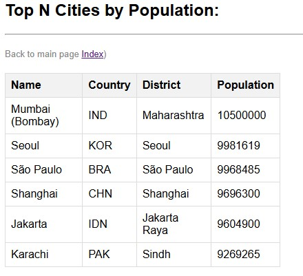

# world-reports

- [Use Cases](use_cases/use_cases.md)

# Evidence of Requirements Being Met

| ID | Name of the Requirement | Met | Screenshot |
|----|--------------------------|-----|------------|
| 1 | All the countries in the world organised by largest population to smallest. | Yes |  |
| 2 | All the cities in the world organised by largest population to smallest. | Yes |  |
| 3 | All the capital cities in the world organised by largest population to smallest. | Yes |  |
| 4 | The top N populated cities in the world where N is provided by the user. | Yes |  |
| 5 | The population of people, people living in cities, and people not living in cities in each country. | No | - |
| 6 | Population Reports | No | - |
| 7 | Language Speaker Report | No | - |

