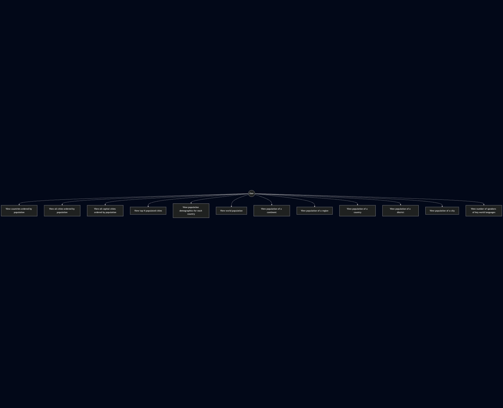

# Use Cases

## Use Case Diagram

---

## Use Cases Description

### **UC01 — View countries ordered by population**

**Actor:** User

**Description:** The user requests a list of all countries ordered by population (descending).

**Preconditions:** Database contains country data.

**Postconditions:** A sorted list is shown.

**Main Flow:**

1. User requests country population report.
2. System retrieves all countries.
3. System orders results by population.
4. System displays the report.

---

### **UC02 — View all cities ordered by population**

**Actor:** User

**Description:** View all cities sorted by descending population.

**Main Flow:**

1. User requests city report.
2. System retrieves all cities.
3. System orders results by population.
4. System displays report.

---

### **UC03 — View all capital cities ordered by population**

**Actor:** User

**Description:** Retrieve all capital cities and list them by population.

---

### **UC04 — View the top N populated cities**

**Actor:** User

**Description:** User specifies an integer **N** to view top N cities.

**Extensions:**

* N < 1 → system returns error.
* N > available cities → system returns all cities.

---

### **UC05 — View population demographics for each country**

**Actor:** User

**Description:** Show population totals, city population, non-city population, and percentages.

---

### **UC06 — View world population**

**Actor:** User

**Description:** Display total world population.

---

### **UC07 — View population of a continent**

**Actor:** User

**Description:** User provides a continent name and retrieves population details.

---

### **UC08 — View population of a region**

**Actor:** User

**Description:** Similar to continent report but filtered by region.

---

### **UC09 — View population of a country**

**Actor:** User

**Description:** User enters a country name or code to view population details.

---

### **UC10 — View population of a district**

**Actor:** User

**Description:** Displays total population of a district.

---

### **UC11 — View population of a city**

**Actor:** User

**Description:** Shows detailed population report for a single city.

---

### **UC12 — View number of speakers of key world languages**

**Actor:** User

**Description:** Display number of speakers and world percentages for Chinese, English, and Spanish.
